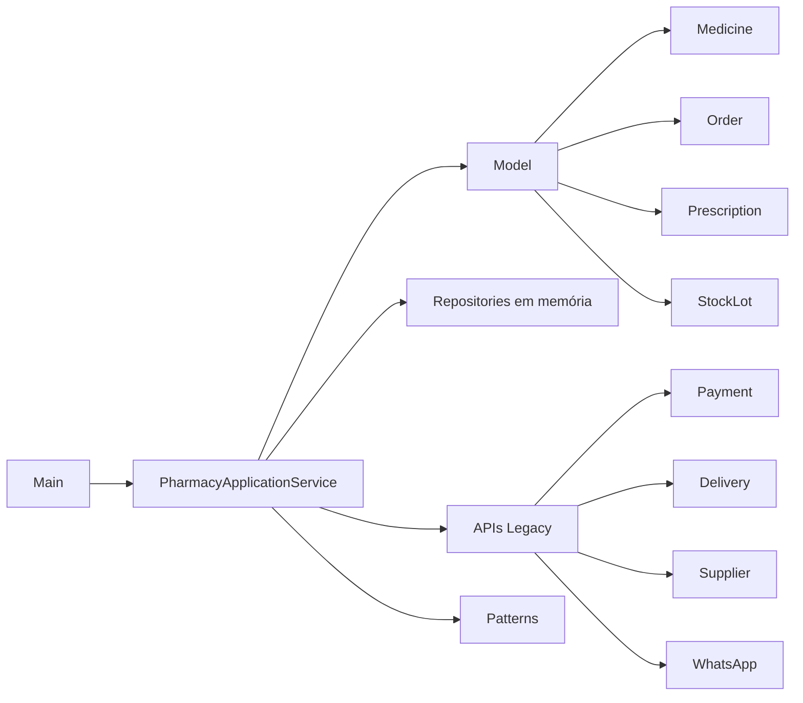
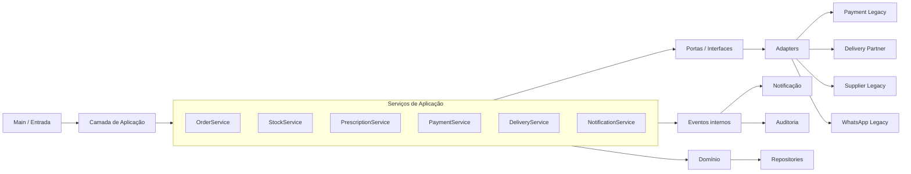

# Aula 06 — Atividade de Análise Arquitetural

## 1. Identificação

- **Projeto:** PharmaLink
- **Grupo:** PharmaLink
- **Integrantes:** Michelly Lima, Ryan Rodrigues, Júllya Andrade e Guilherme Felipe
- **Representante:** Michelly Lima
- **Data:** 09/09/2026

---

## 2. Arquitetura atual

### 2.1 Estrutura identificada

O PharmaLink está organizado atualmente como um **monólito simples em camadas**. A entrada do sistema ocorre pela classe `Main`, que instancia os repositórios e o serviço principal. A camada de aplicação é concentrada principalmente em `PharmacyApplicationService`, enquanto as entidades ficam no pacote `model`, a persistência é simulada por repositórios em memória e as integrações externas são representadas por classes no pacote `legacy`.

O projeto também possui implementações de padrões como Adapter, Facade, Observer, Factory, Abstract Factory e Strategy. Apesar dessa organização, ainda existem responsabilidades concentradas e dependências diretas entre o serviço de aplicação e integrações externas.

### 2.2 Evidências no projeto

- **Evidência 1:** `src/main/java/br/edu/pharmalink/Main.java` — ponto de entrada e montagem do fluxo.
- **Evidência 2:** `service/PharmacyApplicationService.java` — concentra estoque, receita, pagamento, entrega, notificação e eventos.
- **Evidência 3:** `repository/InMemoryMedicineRepository.java` e `repository/InMemoryStockRepository.java` — persistência em memória.
- **Evidência 4:** `legacy/PaymentLegacyGateway.java`, `DeliveryPartnerApi.java`, `SupplierLegacyApi.java` e `WhatsappLegacyApi.java` — integrações externas simuladas.
- **Evidência 5:** pacotes `patterns/adapter`, `patterns/facade`, `patterns/observer`, `patterns/factory`, `patterns/abstractfactory` e `patterns/strategy`.

### 2.3 Diagrama simplificado da arquitetura atual

---

## 3. Requisitos funcionais analisados

| ID | Requisito funcional | Evidência no projeto |
|---|---|---|
| RF01 | Permitir a criação e finalização de pedidos de medicamentos. | `createOrder()`, `addItem()` e `finishOrder()` em `PharmacyApplicationService`; `Order.java`. |
| RF02 | Controlar o estoque e dar baixa no lote ao adicionar um item ao pedido. | `InMemoryStockRepository.findByMedicine()`, `StockLot.quantity` e `addItem()`. |
| RF03 | Tratar medicamentos que exigem receita. | `Medicine.prescriptionRequired` e parâmetro `prescriptionNumber` em `addItem()`. |
| RF04 | Processar pagamento, entrega e notificação. | `PaymentLegacyGateway`, `DeliveryPartnerApi`, `WhatsappLegacyApi` e `finishOrder()`. |

---

## 4. Requisitos não funcionais analisados

| ID | Requisito não funcional | Como pode ser verificado |
|---|---|---|
| RNF01 | **Manutenibilidade:** separar pedido, estoque, receita, pagamento, entrega e notificação em componentes com responsabilidades claras. | Revisar dependências e verificar se uma única classe deixou de concentrar todas as regras e integrações. |
| RNF02 | **Segurança:** medicamentos que exigem receita não devem ser finalizados sem validação mínima, e dados sensíveis não devem ser expostos em logs. | Testar pedido com `prescriptionNumber` vazio e revisar saídas de log. |
| RNF03 | **Disponibilidade/confiabilidade:** falha de notificação ou auditoria não deve impedir o registro de um pedido pago. | Simular falha do notificador e verificar se o estado principal do pedido é preservado. |
| RNF04 | **Desempenho:** evitar integrações externas desnecessárias antes das validações de negócio; 95% das operações locais devem finalizar em até 2 segundos. | Medir o fluxo e revisar a ordem das chamadas. |

---

## 5. Relação RNF × parte da arquitetura

| RNF | Parte da arquitetura afetada | Justificativa |
|---|---|---|
| RNF01 | Camada de aplicação/serviços | `PharmacyApplicationService` concentra muitas decisões, aumentando acoplamento e dificultando testes e manutenção. |
| RNF02 | Domínio, receita e pagamento | O fluxo atual pode continuar mesmo sem receita válida e possui fronteiras pouco claras para pagamento. |
| RNF03 | Notificação, auditoria e eventos | `OrderPublisher` mantém somente um observer, podendo substituir notificação por auditoria. |
| RNF04 | Integrações e persistência | Pagamento, entrega e WhatsApp estão ligados diretamente ao serviço principal e podem impactar o tempo do fluxo. |

---

## 6. Problema arquitetural identificado

### Problema identificado

O principal problema é a **concentração de responsabilidades e o alto acoplamento em `PharmacyApplicationService`**. A classe coordena regras de estoque, receita, desconto, pagamento, entrega, notificação e eventos, além de conhecer diretamente APIs legadas.

### Evidência

O serviço possui dependências diretas para `PaymentLegacyGateway`, `DeliveryPartnerApi`, `WhatsappLegacyApi` e `DiscountCalculator`. O `OrderPublisher` recebe `CustomerNotificationObserver` e depois `AuditObserver`, fazendo o segundo substituir o primeiro. Em `finishOrder()`, a entrega também pode ser acionada mesmo quando o pagamento falha.

### Consequência possível

Maior dificuldade de manutenção e teste, risco de pedido seguir sem receita válida, possibilidade de despacho após falha de pagamento e perda de notificação ou auditoria.

---

## 7. Alternativas arquiteturais

- **Alternativa A:** manter o monólito em camadas simples atual.
- **Alternativa B:** evoluir para **monólito modular em camadas, com portas/adapters e eventos internos**.
- **Alternativa C:** migrar para microsserviços/SOA separados por domínio.

---

## 8. Matriz de decisão arquitetural

A matriz completa, com pesos, notas e cálculos `Peso × Nota`, está no arquivo:

`README-Aula-06-Matriz-Decisao-PharmaLink.md`

**Resultado:**

- Alternativa A: **45 pontos**
- Alternativa B: **69 pontos**
- Alternativa C: **60 pontos**

---

## 9. Justificativa das notas

As justificativas individuais de todas as notas estão no arquivo:

`README-Aula-06-Justificativas-PharmaLink.md`

---

## 10. Decisão arquitetural

### Alternativa escolhida

**Alternativa B — Monólito modular em camadas, com portas/adapters e eventos internos.**

### Justificativa da decisão

Essa alternativa responde aos problemas encontrados sem adicionar uma infraestrutura desnecessária ao estágio atual do projeto. O PharmaLink continua sendo uma única aplicação Java, mas passa a possuir fronteiras mais claras entre domínio, aplicação, persistência e integrações. Isso reduz o acoplamento com APIs legadas, melhora testabilidade e facilita o tratamento de segurança, disponibilidade e manutenção.

---

## 11. Trade-off

- **Ganho:** maior separação de responsabilidades, menor acoplamento, melhor testabilidade e evolução mais segura das integrações.
- **Custo ou consequência:** necessidade de refatorar classes, criar interfaces, ajustar o fluxo do pedido e ampliar os testes.
- **Trade-off aceito pelo grupo:** aceitar mais organização e estrutura interna agora para reduzir riscos futuros, sem assumir a complexidade operacional de microsserviços.

---

## 12. Arquitetura proposta

### Melhorias propostas

1. Dividir responsabilidades em `OrderService`, `StockService`, `PrescriptionService`, `PaymentService`, `DeliveryService` e `NotificationService`.
2. Criar portas como `PaymentPort`, `DeliveryPort`, `SupplierPort` e `NotificationPort`.
3. Transformar integrações `legacy` em adapters dessas interfaces.
4. Permitir múltiplos handlers no fluxo de eventos para manter notificação e auditoria.
5. Bloquear ou colocar em revisão pedidos de medicamentos controlados sem receita válida.
6. Impedir despacho quando o pagamento falhar.
7. Trabalhar com estados explícitos do pedido, como `CREATED`, `WAITING_PRESCRIPTION`, `PAID`, `PAYMENT_ERROR` e `DISPATCHED`.

---

## 13. Conclusão

A análise mostrou que o PharmaLink possui uma base em camadas, porém ainda apresenta alto acoplamento e responsabilidades concentradas. Foram comparadas a manutenção da arquitetura atual, a evolução para monólito modular e a adoção de microsserviços/SOA.

A Alternativa B obteve **69 pontos** e foi escolhida porque melhora os principais requisitos de qualidade sem criar complexidade operacional incompatível com o estágio atual do projeto. Dessa forma, o PharmaLink pode evoluir gradualmente, mantendo uma única aplicação e preparando fronteiras mais claras para futuras mudanças.
