# Diagrama Arquitetural — PharmaLink

Este diagrama representa a arquitetura proposta na **ADR-004**, mantendo o PharmaLink como um **Monólito Modular em Camadas**, com separação de responsabilidades, uso de **Ports/Adapters** para integrações externas e **eventos internos** para notificação e auditoria.

```mermaid
flowchart TB

    %% =========================
    %% ENTRADA
    %% =========================
    subgraph ENTRADA["🖥️ Camada de Entrada"]
        MAIN["Main / Entrada da Aplicação"]
    end

    %% =========================
    %% APLICAÇÃO
    %% =========================
    subgraph APLICACAO["⚙️ Camada de Aplicação"]
        ORDER["OrderService<br/>Pedidos"]
        STOCK["StockService<br/>Estoque"]
        PRESCRIPTION["PrescriptionService<br/>Receitas"]
        PAYMENT["PaymentService<br/>Pagamentos"]
        DELIVERY["DeliveryService<br/>Entregas"]
        NOTIFICATION["NotificationService<br/>Notificações"]
    end

    %% =========================
    %% DOMÍNIO
    %% =========================
    subgraph DOMINIO["🧩 Camada de Domínio"]
        MEDICINE["Medicine"]
        ORDER_MODEL["Order"]
        PRESCRIPTION_MODEL["Prescription"]
        STOCKLOT["StockLot"]
        RULES["Regras de Negócio"]
    end

    %% =========================
    %% REPOSITÓRIOS
    %% =========================
    subgraph PERSISTENCIA["🗄️ Persistência"]
        MED_REPO["MedicineRepository"]
        STOCK_REPO["StockRepository"]
        INMEM_MED["InMemoryMedicineRepository"]
        INMEM_STOCK["InMemoryStockRepository"]
    end

    %% =========================
    %% PORTAS
    %% =========================
    subgraph PORTS["🔌 Ports / Interfaces"]
        PAYMENT_PORT["PaymentPort"]
        DELIVERY_PORT["DeliveryPort"]
        SUPPLIER_PORT["SupplierPort"]
        NOTIFICATION_PORT["NotificationPort"]
    end

    %% =========================
    %% ADAPTERS
    %% =========================
    subgraph ADAPTERS["🔄 Adapters / Integrações"]
        PAYMENT_ADAPTER["PaymentLegacyAdapter"]
        DELIVERY_ADAPTER["DeliveryPartnerAdapter"]
        SUPPLIER_ADAPTER["SupplierLegacyAdapter"]
        WHATSAPP_ADAPTER["WhatsappAdapter"]
    end

    %% =========================
    %% SISTEMAS EXTERNOS
    %% =========================
    subgraph EXTERNOS["🌐 Sistemas Externos / Legacy"]
        PAYMENT_LEGACY["PaymentLegacyGateway"]
        DELIVERY_API["DeliveryPartnerApi"]
        SUPPLIER_API["SupplierLegacyApi"]
        WHATSAPP_API["WhatsappLegacyApi"]
    end

    %% =========================
    %% EVENTOS
    %% =========================
    subgraph EVENTOS["📨 Eventos Internos"]
        PUBLISHER["OrderPublisher"]
        EVENT_NOTIFICATION["CustomerNotificationObserver"]
        EVENT_AUDIT["AuditObserver"]
    end

    %% FLUXO PRINCIPAL
    MAIN --> ORDER

    ORDER --> STOCK
    ORDER --> PRESCRIPTION
    ORDER --> PAYMENT
    ORDER --> DELIVERY
    ORDER --> NOTIFICATION

    %% DOMÍNIO
    ORDER --> ORDER_MODEL
    STOCK --> STOCKLOT
    STOCK --> MEDICINE
    PRESCRIPTION --> PRESCRIPTION_MODEL
    PRESCRIPTION --> MEDICINE

    ORDER_MODEL --> RULES
    MEDICINE --> RULES
    PRESCRIPTION_MODEL --> RULES
    STOCKLOT --> RULES

    %% PERSISTÊNCIA
    STOCK --> MED_REPO
    STOCK --> STOCK_REPO

    MED_REPO -. implementação .-> INMEM_MED
    STOCK_REPO -. implementação .-> INMEM_STOCK

    %% PORTAS
    PAYMENT --> PAYMENT_PORT
    DELIVERY --> DELIVERY_PORT
    STOCK --> SUPPLIER_PORT
    NOTIFICATION --> NOTIFICATION_PORT

    %% ADAPTERS
    PAYMENT_PORT -. implementada por .-> PAYMENT_ADAPTER
    DELIVERY_PORT -. implementada por .-> DELIVERY_ADAPTER
    SUPPLIER_PORT -. implementada por .-> SUPPLIER_ADAPTER
    NOTIFICATION_PORT -. implementada por .-> WHATSAPP_ADAPTER

    %% INTEGRAÇÕES
    PAYMENT_ADAPTER --> PAYMENT_LEGACY
    DELIVERY_ADAPTER --> DELIVERY_API
    SUPPLIER_ADAPTER --> SUPPLIER_API
    WHATSAPP_ADAPTER --> WHATSAPP_API

    %% EVENTOS
    ORDER --> PUBLISHER
    PUBLISHER --> EVENT_NOTIFICATION
    PUBLISHER --> EVENT_AUDIT

    %% ESTILOS
    classDef entrada fill:#e3f2fd,stroke:#1565c0,stroke-width:2px,color:#0d47a1;
    classDef app fill:#e8f5e9,stroke:#2e7d32,stroke-width:2px,color:#1b5e20;
    classDef dominio fill:#fff3e0,stroke:#ef6c00,stroke-width:2px,color:#e65100;
    classDef persist fill:#f3e5f5,stroke:#7b1fa2,stroke-width:2px,color:#4a148c;
    classDef ports fill:#ede7f6,stroke:#512da8,stroke-width:2px,color:#311b92;
    classDef adapters fill:#e0f2f1,stroke:#00796b,stroke-width:2px,color:#004d40;
    classDef externos fill:#fce4ec,stroke:#c2185b,stroke-width:2px,color:#880e4f;
    classDef eventos fill:#fff8e1,stroke:#f9a825,stroke-width:2px,color:#f57f17;

    class MAIN entrada;
    class ORDER,STOCK,PRESCRIPTION,PAYMENT,DELIVERY,NOTIFICATION app;
    class MEDICINE,ORDER_MODEL,PRESCRIPTION_MODEL,STOCKLOT,RULES dominio;
    class MED_REPO,STOCK_REPO,INMEM_MED,INMEM_STOCK persist;
    class PAYMENT_PORT,DELIVERY_PORT,SUPPLIER_PORT,NOTIFICATION_PORT ports;
    class PAYMENT_ADAPTER,DELIVERY_ADAPTER,SUPPLIER_ADAPTER,WHATSAPP_ADAPTER adapters;
    class PAYMENT_LEGACY,DELIVERY_API,SUPPLIER_API,WHATSAPP_API externos;
    class PUBLISHER,EVENT_NOTIFICATION,EVENT_AUDIT eventos;
```

## Leitura do diagrama

- A **Camada de Entrada** inicia o fluxo da aplicação.
- A **Camada de Aplicação** organiza os serviços por responsabilidade.
- A **Camada de Domínio** mantém entidades e regras de negócio.
- Os **Repositórios** isolam o acesso aos dados.
- As **Ports** definem contratos para integrações externas.
- Os **Adapters** implementam esses contratos e encapsulam as APIs legadas.
- Os **Eventos Internos** permitem que notificação e auditoria ocorram de forma desacoplada do fluxo principal.

## Decisão arquitetural relacionada

Este diagrama corresponde à decisão registrada na **ADR-004 — Evolução da arquitetura do PharmaLink para Monólito Modular**.
